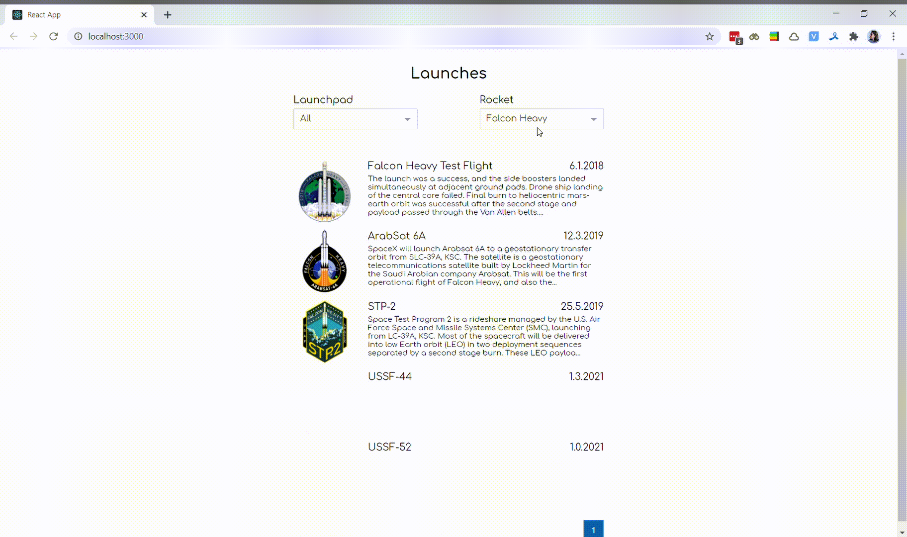

# SpaceX

Приложение для просмотра всех запусков SpaceX с фильтрацией по ракетам и стартовым площадкам. Тестовое задание для Overgear.

## Как запустить:

``npm i && npm run start``

## Функционал:

- Фильтрация по ракетам и стартовым площадкам
- Пагинация по полученным данным

## Технологии

**React, React Hooks, Redux, Typescript, Webpack, Babel, API(SpaceX-API), Шикарные шрифты.**

## Авторы

- [Александра Волобуева](https://github.com/RabbitWithoutaHat/)

